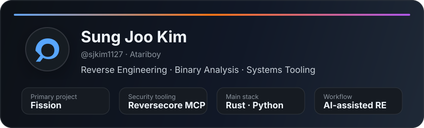

<div align="center">

# Sung Joo Kim

**Reverse Engineering · Binary Analysis · Systems Tooling · AI-Assisted Security Workflows**

I build tools that turn low-level program behavior into structured, traceable, and useful analysis.

[](https://github.com/sjkim1127)
[](https://github.com/sjkim1127/Fission)
[](https://github.com/sjkim1127/Reversecore_MCP)

</div>

---

## About me

I'm an independent developer focused on reverse engineering infrastructure, binary analysis, decompiler pipelines, and AI-assisted security tooling.

My work sits at the intersection of:

- **Reverse engineering** — disassembly, decompilation, IR design, binary loading, and semantic recovery
- **Systems engineering** — Rust workspaces, architecture boundaries, testing discipline, and toolchain design
- **Security automation** — static/dynamic analysis workflows, vulnerability triage, malware analysis, and forensic reporting
- **AI-native developer tooling** — MCP servers, agent workflows, and natural-language interfaces for complex technical systems

I care about tools that are not just impressive in demos, but mechanically traceable, semantically defensible, and useful under real analyst workflows.

---

## Current focus

### [Fission](https://github.com/sjkim1127/Fission)

A Rust-native reverse-engineering and binary decompilation workspace.

Fission explores an owned decompiler pipeline around instruction lifting, intermediate representations, structuring, rendering, automation, and quality gates. The long-term goal is to produce decompiler output that is traceable, defensible, and readable enough for real reverse engineering work.

### [Reversecore MCP](https://github.com/sjkim1127/Reversecore_MCP)

An MCP-based reverse engineering and security analysis server.

Reversecore MCP connects AI clients to practical analysis capabilities such as binary parsing, disassembly, decompilation, malware triage, vulnerability research, SAST, forensics, reporting, and MITRE ATT&CK-style structured analysis.

---

## What I like building

```text
binary -> loader -> decoder -> IR -> analysis -> structure -> readable output -> report
```

I enjoy projects where architecture matters: compilers, decompilers, program analysis, security tooling, developer infrastructure, and systems that need clear ownership boundaries.

---

## Technical interests

- Reverse engineering and binary security
- Decompiler architecture and intermediate representations
- Rust systems programming
- Static analysis, symbolic execution, and vulnerability research
- Malware triage and forensic automation
- Model Context Protocol and agentic tooling
- Tooling that makes expert workflows faster without hiding the evidence

---

## Selected projects

| Project | Description |
|---|---|
| [Fission](https://github.com/sjkim1127/Fission) | Rust-native reverse-engineering and decompiler workspace |
| [Reversecore MCP](https://github.com/sjkim1127/Reversecore_MCP) | AI-powered reverse engineering and security analysis through MCP |
| [fission-benchmark](https://github.com/sjkim1127/fission-benchmark) | Benchmark and evaluation support around Fission |

---

## Recent commits

<!-- RECENT-COMMITS:START -->
| Time | Repository | Commit | Message |
|---|---|---|---|
| 2026-07-06 15:41 KST | [sjkim1127/Fission](https://github.com/sjkim1127/Fission) | [03df601](https://github.com/sjkim1127/Fission/commit/03df601c400db29aa19320099e772f6ec2687f7f) | feat(emulator): Fix register space lookup and complete HLE Dispatcher |
| 2026-07-06 15:26 KST | [sjkim1127/Eon](https://github.com/sjkim1127/Eon) | [ac3ddd4](https://github.com/sjkim1127/Eon/commit/ac3ddd4a15950d3d6e3ba91645ca4ce0ec95ecfc) | i18n: High-quality translations for English, Chinese, and Russian |
| 2026-07-06 15:16 KST | [sjkim1127/Eon](https://github.com/sjkim1127/Eon) | [39e09fa](https://github.com/sjkim1127/Eon/commit/39e09fadda0e84e28dd0049548a6926f3a126730) | refactor(ui): extract and map all remaining korean strings to TK in phase 2 (iching, western, hd, zwds) |
| 2026-07-06 15:14 KST | [sjkim1127/Fission](https://github.com/sjkim1127/Fission) | [78c6167](https://github.com/sjkim1127/Fission/commit/78c6167f498d06a53090b9f642917bdddc137549) | fix: integrate emulator backend to CLI and fix trait abstraction for debug session |
| 2026-07-06 15:07 KST | [sjkim1127/Eon](https://github.com/sjkim1127/Eon) | [6e99845](https://github.com/sjkim1127/Eon/commit/6e998450e55ac63bd11987c91ab5fa9bf05db595) | i18n: Migrate Qimen, Simulation, AI and Strength tabs to TK enum |
| 2026-07-06 15:04 KST | [sjkim1127/Fission](https://github.com/sjkim1127/Fission) | [9c9c386](https://github.com/sjkim1127/Fission/commit/9c9c38633715742993847dc14d4ce84ca0749525) | feat: complete P-Code Evaluator ops and integrate loader mapping |
| 2026-07-06 14:57 KST | [sjkim1127/Fission](https://github.com/sjkim1127/Fission) | [e590756](https://github.com/sjkim1127/Fission/commit/e5907562cda65a08c9aafde2dff2842f57351ea7) | feat(debug): Integrate EmulatorBackend into DebugSession and add --emulator CLI flag |
| 2026-07-06 14:45 KST | [sjkim1127/Reversecore_MCP](https://github.com/sjkim1127/Reversecore_MCP) | [3d0021e](https://github.com/sjkim1127/Reversecore_MCP/commit/3d0021e0a502555232bec57a297588f3111ad33e) | feat(report): implement CSAF VEX report generator |

<!-- Last updated: 2026-07-06 15:55 KST -->
<!-- RECENT-COMMITS:END -->

---

## Direction

I'm currently pushing deeper into decompiler correctness, binary semantics, automated analysis quality, and AI-assisted reverse engineering workflows.

The goal is simple:

> Build tools that help analysts understand complex binaries faster, without sacrificing evidence, control, or technical rigor.

---

<div align="center">



</div>
