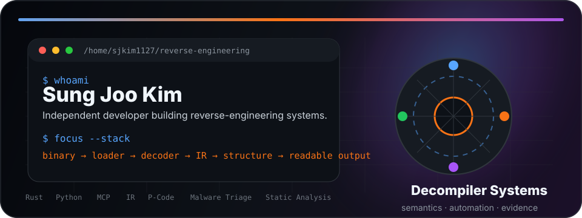
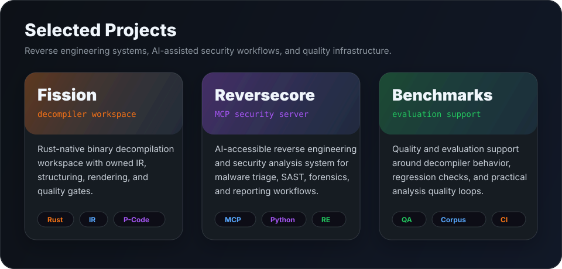
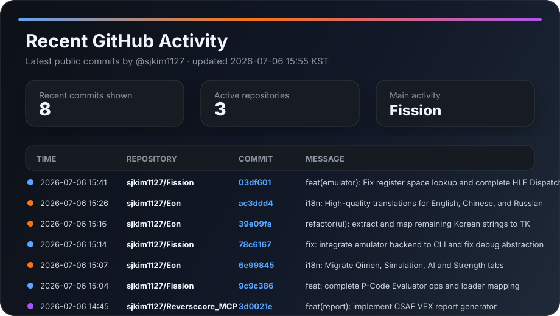

<div align="center">



<br />

[](https://github.com/sjkim1127)
[](https://github.com/sjkim1127/Fission)
[](https://github.com/sjkim1127/Reversecore_MCP)
[](https://www.rust-lang.org/)
[](https://www.python.org/)

</div>

---

## Identity

I'm an independent developer focused on **reverse engineering infrastructure**, **binary analysis**, **decompiler pipelines**, and **AI-assisted security tooling**.

I build tools that turn low-level program behavior into structured, traceable, and useful analysis.

```text
binary → loader → decoder → IR → analysis → structure → readable output → report
```

My bias is toward systems that are mechanically traceable, semantically defensible, and useful under real analyst workflows.

---

## Current operating area

| Area | Focus |
|---|---|
| Reverse engineering | Disassembly, decompilation, binary loading, semantic recovery |
| Decompiler systems | IR design, P-Code/NIR/HIR-style pipelines, structuring, rendering |
| Security automation | Static/dynamic analysis, malware triage, vulnerability research, forensics |
| AI-native tooling | MCP servers, agent workflows, natural-language interfaces for technical systems |
| Systems engineering | Rust workspaces, architecture boundaries, CI, quality gates |

---

## Selected projects

<div align="center">



</div>

| Project | Description |
|---|---|
| [Fission](https://github.com/sjkim1127/Fission) | Rust-native reverse-engineering and decompiler workspace |
| [Reversecore MCP](https://github.com/sjkim1127/Reversecore_MCP) | AI-powered reverse engineering and security analysis through MCP |
| [fission-benchmark](https://github.com/sjkim1127/fission-benchmark) | Benchmark and evaluation support around Fission |

---

## Stack map

<div align="center">


</div>

```text
Core:        Rust · Python · Linux · GitHub Actions
Reverse:     loaders · disassemblers · decompilers · IR · P-Code · structuring
Security:    malware triage · SAST · vulnerability research · forensics · reporting
AI tooling:  MCP · agent workflows · natural-language analysis interfaces
```

---

## GitHub activity

<div align="center">



</div>

---

## Working principle

> Build tools that help analysts understand complex binaries faster, without sacrificing evidence, control, or technical rigor.

I am currently pushing deeper into decompiler correctness, binary semantics, automated analysis quality, and AI-assisted reverse engineering workflows.

---

<div align="center">


</div>
